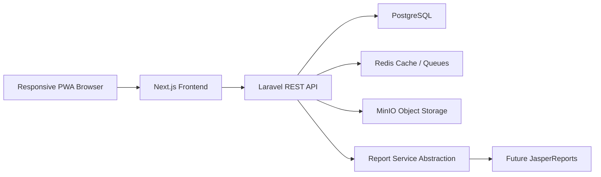

# Architecture

## System Architecture

The ERP is split into a Laravel API backend and a Next.js frontend.

## Backend

- Laravel 12, PHP 8.4.
- JWT access tokens plus hashed refresh tokens.
- RBAC tables: roles, permissions, user roles, role permissions.
- Audit logs for login/create/update/delete/export workflows.
- Payroll rules are versioned JSON, never hard-coded legal rates.
- MinIO-compatible file storage.

## Frontend

- Next.js app router.
- Arabic-first labels with English support.
- RTL/LTR switching by locale route.
- Dark/light mode.
- PWA manifest and service worker.
- shadcn-style local components.
